# Dependency map

Cross-module wiring for AI agents. Prefer extending existing edges; do not invent parallel pipelines.

```
related_skills: offers/, learning/, authentication/, ai/, multi-tenancy/
```

## Hiring lifecycle (happy path)

```mermaid
flowchart LR
  A[Recruiter invite + offer] --> B[Invitation token]
  B --> C[Candidate register + OTP]
  C --> D[Offer view / negotiate / sign]
  D --> E[Pre-hire onboarding]
  E --> F[Documents + OCR + verify]
  F --> G[IT provisioning token]
  G --> H[Approve and activate employee]
  H --> I[Complete Profile + Day-1]
  I --> J[Learning / Talent / Messages]
```



| Step | Primary backend | Frontend |
|------|-----------------|----------|
| Invite / bulk (+ required offer) | `invitation_service`, `bulk_invite_service`, `offer_service` | `/dashboard/recruiter/invite` |
| Accept | `auth_service` + invitations token | `/invite/[token]` |
| Offer | `offer_service` | `/offer` |
| Onboarding | `candidate_service` | `/onboarding` |
| Documents | `document_service`, extraction/OCR | `/documents`, DocumentManager |
| IT setup | `it_provisioning_service` | `/it-setup/[token]` |
| Activate | `employee_service.create_from_candidate`, offer approve paths | recruiter employees/candidates |
| Post-hire | complete profile, learning, talent, messages, career | employee dashboard |

**Invariant:** Offer is created with the invitation; signing is required before onboarding mutations (`require_signed_offer`). Do not reorder docs-before-offer in new features.

History / rehire: `people_history.py`, `cycle_group_key` / `history_bucket` on candidates & employees. Converted candidates become employees (new `employee_id` on reconversion).

## Cross-module dependencies

### OCR → documents → recruitment

```
Upload (documents API / agent ui_hint)
  → storage_service (Cloudinary)
  → document_extraction_service / ocr_service (ENABLE_OCR)
  → structured fields (CNIC, bank/IBAN, education, …)
  → profile update (employee/candidate onboarding)
  → recruiter verify/reject (documents.review)
  → offer / activation gates that require verified docs
```

Frontend: `components/ai-experience/*`, `lib/ai/documentProcessing.js`, `hooks/useDocumentProcessing.js`.

Embeddings (`ENABLE_EMBEDDINGS`) optional for resumes — do not require for core hiring path.

### Org framework ↔ learning ↔ career

```
org_framework_* collections (departments, roles, skills, certs, courses, roadmaps, promotion_rules)
  ↔ organization_framework_service /api/org-framework
  ↔ learning catalog assignment & skill gaps (learning_* services)
  ↔ career_framework (tracks/levels/assignments/readiness) still used by Talent
```

`main.py` comment: org framework owns departments/roles/skills; career-framework still serves promotion paths, levels, assignments, readiness for Talent.

UI: `/dashboard/recruiter/organization-config`, learning pages, employee career/talent.

### Agent → services (never DB shortcuts)

```
/api/agent/chat
  → agent_service (MAX_TOOL_STEPS=4)
  → agent_tools / parity / super_admin tools
  → invitation_service | offer_service | employee_service
    | document_service | learning_service | talent_service
    | message_service | dashboard_service | organization_service | …
  → Mongo / SMTP / Cloudinary / LLM as those services already do
```

Same RBAC and `recruiter_people_scope` as REST. Adding an agent capability without a service function is the wrong layer.

### Auth → everything

```
auth_service / security.get_current_user
  → CurrentUser (role, permissions, capabilities, organization_id)
  → every Require* dependency
  → service-level scope helpers
```

### Super Admin → tenancy

```
super_admin API
  → organization_service (modules, purge)
  → recruiter capability updates
  → binds recruiters → organization_id
```

### IT ↔ activation

```
offer signed → it_provisioning_requests (public token)
  → company email + assets + encrypted temp password
  → recruiter Approve & activate
  → employee company-email login / OTP helpers
```

Employee IT support: `it_service_requests` public fulfill flow.

### Messaging & tickets

- `hr_threads` — employee ↔ recruiter (`messages` API).
- `tickets` — recruiter support; `admin_tickets` — super-admin ops.
- Notifications/announcements — `dashboard` API; org-scoped announcements.

### Learning providers (external)

```
Coursera catalog (coursera_service) ──┐
MS Learn catalog (ms_learn_service) ──┼→ learning_courses / providers / import engine
Generic API providers (encrypted) ────┘
  → enrollments / assignments / certificates → learning_ai_service
```

## Layer dependency direction (allowed)

```
api → services → (database | crypto | email | storage | llm)
frontend pages → services/*.js → apiClient → api
lib/ai (UX) ↛ agent_tools   (context only; chat uses agent API)
```

Forbidden shortcuts:

- Router → raw Mongo business logic
- Agent tool → collection.find without service RBAC
- Frontend page → axios to backend bypassing `services/` (for domain APIs)
- Cross-org queries without Super Admin intent

## Agent checklist

1. Trace the lifecycle edge you are on before changing status fields.
2. If OCR fields change, update extraction **and** onboarding persistence **and** any agent write tools.
3. Org framework edits can invalidate learning/career assumptions — check both.
4. Keep dependency arrows one-way; lift shared logic into services, not routers.
